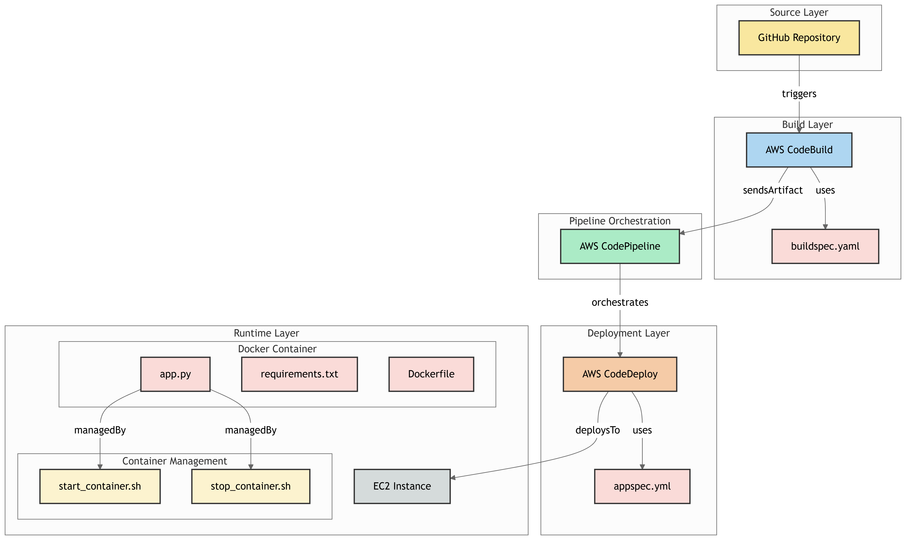

# AWS Continuous Integration Setup

This guide provides step-by-step instructions to set up continuous integration for a Python application using AWS services.
The pipline after build will look like:

## 1. Set up GitHub Repository

1. Create a new GitHub repository for your project.
2. Add the necessary files for your application and version control. Ensure you include files like:
   - `app.py` (your main Python application file)
   - `requirements.txt` (list of dependencies)
   - `.gitignore` (to exclude unnecessary files from version control)

## 2. Configure AWS CodeBuild

AWS CodeBuild will handle building and packaging your application for deployment.

### Steps:

1. Navigate to the AWS CodeBuild service in the AWS Management Console.
2. Create a new build project and provide a name for the project.
3. For the source provider, choose **GitHub**.
4. Select **Public Repository** and connect to your GitHub account.
5. Configure the build environment:
   - Choose the operating system (e.g., Amazon Linux or Ubuntu).
   - Select the runtime (e.g., Python).
   - Specify compute resources as per your application's needs.
6. In the **Role name** field, create a new role in the IAM service with the use case set to **CodeBuild**.

## 3. Create Parameters in AWS Systems Manager

Create secure parameters for your application using AWS Systems Manager Parameter Store.

### Steps:

1. Navigate to AWS Systems Manager in the AWS Management Console.
2. Under **Parameter Store**, create parameters for your application:
   - `username`: Your Docker username.
   - `password`: Your Docker access token.
   - `url`: Your application's Docker image repository URL.

## 4. Create an AWS CodePipeline

Set up an automated pipeline for continuous integration using AWS CodePipeline.

### Steps:

1. Navigate to the AWS CodePipeline service in the AWS Management Console.
2. Click on the **Create pipeline** button.
3. Choose **Build custom pipeline** and provide a name for your pipeline.
4. For the **Source** stage:
   - Select **GitHub** as the source provider.
   - Connect your GitHub account to AWS CodePipeline.
   - Select your repository and branch.
5. For the **Build** stage:
   - Select **AWS CodeBuild** as the build provider.
6. Review the pipeline configuration.
7. Click on the **Create pipeline** button to finalize the setup.

---

Your continuous integration pipeline is now ready to build and deploy your Python application automatically!
